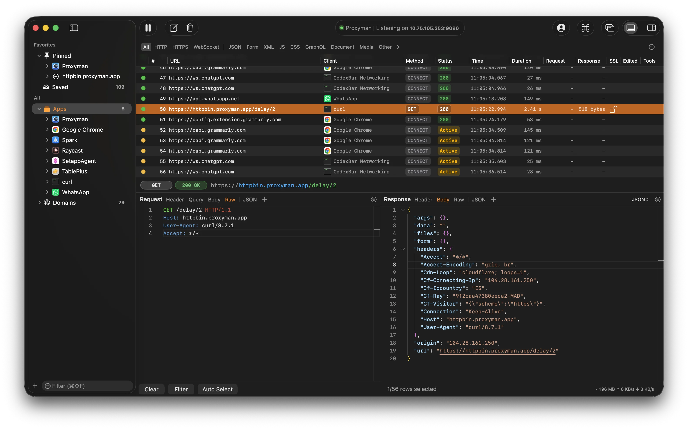

# Production App Examples

Use these screenshots as calibration examples for Mac-assed software. They are not templates to copy pixel-for-pixel; they show how production apps can be platform-specific without becoming generic or inaccessible.

## Proxyman

Proxyman is a dense professional network-debugging app that still reads as a Mac app:

- It uses a familiar Mac window shape: sidebar, toolbar, table, split panes, bottom status area.
- The main object model is visible: captured traffic grouped by favorites, apps, and domains.
- The interface supports scanning and repeated work with dense tables, row selection, status badges, filters, and detail inspectors.
- Custom visual identity is present, especially in the dark theme and orange selection, but the structure stays Mac-native.
- The app treats technical users as experts without hiding Mac affordances like source lists, split views, toolbars, and keyboard-friendly tables.

Useful lesson: a Mac-assed app can be highly specialized and information-dense when its custom styling reinforces the workflow instead of replacing platform structure.

## NetNewsWire

NetNewsWire is a content app with classic Mac information architecture:

- It uses a three-pane layout: feed/source list, article list, reading pane.
- The hierarchy matches the user's mental model: feeds and folders on the left, selected article list in the middle, article content on the right.
- Selection, unread counts, toolbar commands, search, and sidebar disclosure all follow familiar Mac patterns.
- The app is visually restrained so reading stays primary.
- Expressive identity shows up through feed icons, article previews, and comfortable typography rather than custom controls fighting the platform.

Useful lesson: a Mac-assed app can feel plain in the best way. The app gets out of the way by leaning on durable Mac conventions.

## What To Look For

When adding more examples, prefer screenshots that show:

- Platform-native structure: sidebars, split views, toolbars, inspectors, tables, source lists, sheets, panels, menus.
- A clear task model: objects, selection, actions, state, hierarchy.
- Real production density: enough content to judge scanning, not empty marketing states.
- Expressive identity that lives above the structure: icons, color, typography, motion, tone, domain-specific details.
- Accessibility-friendly restraint: custom UI that does not erase labels, focus, contrast, keyboard paths, or standard behaviors.
